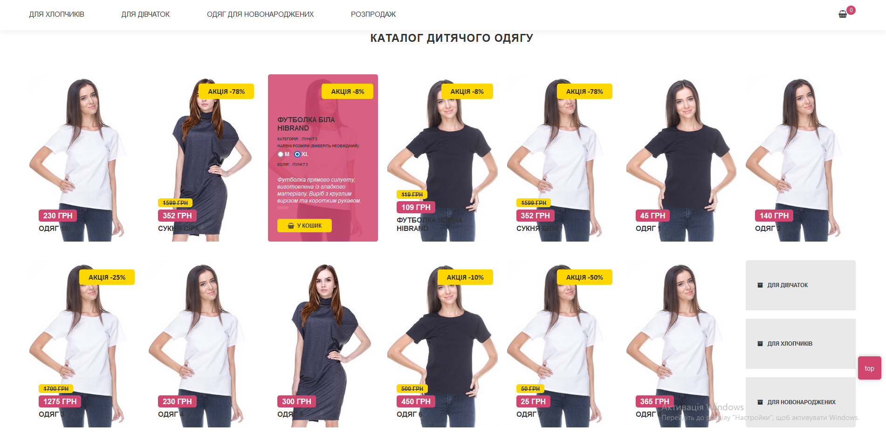
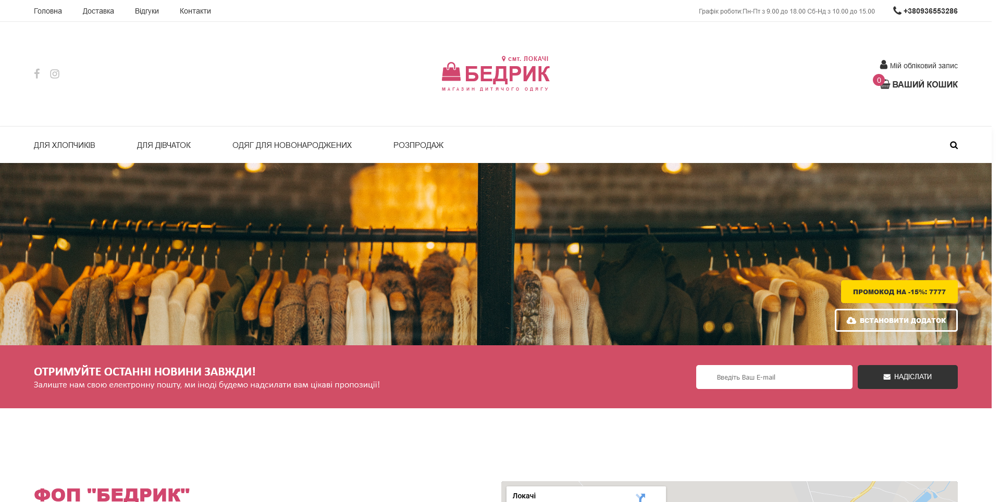
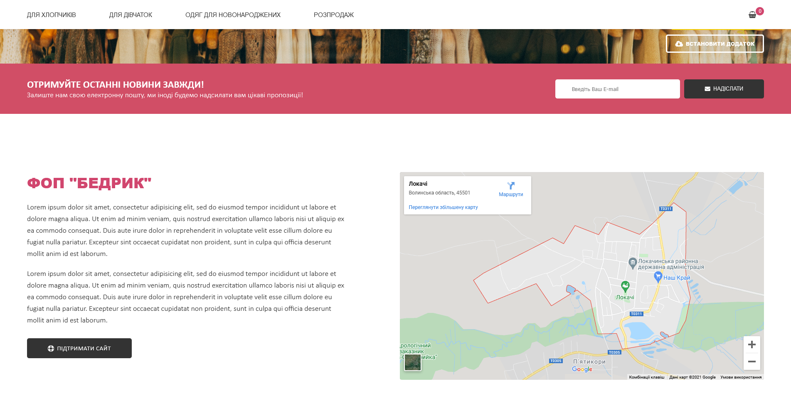
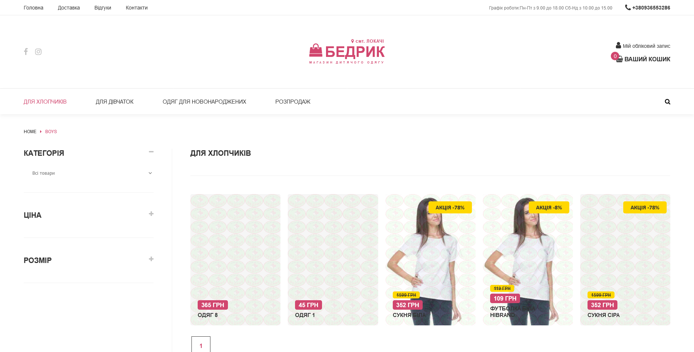
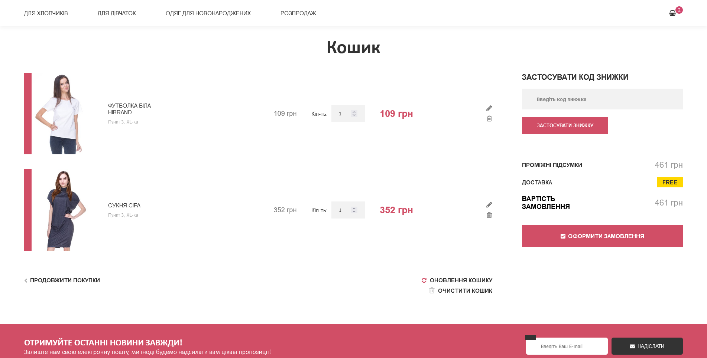
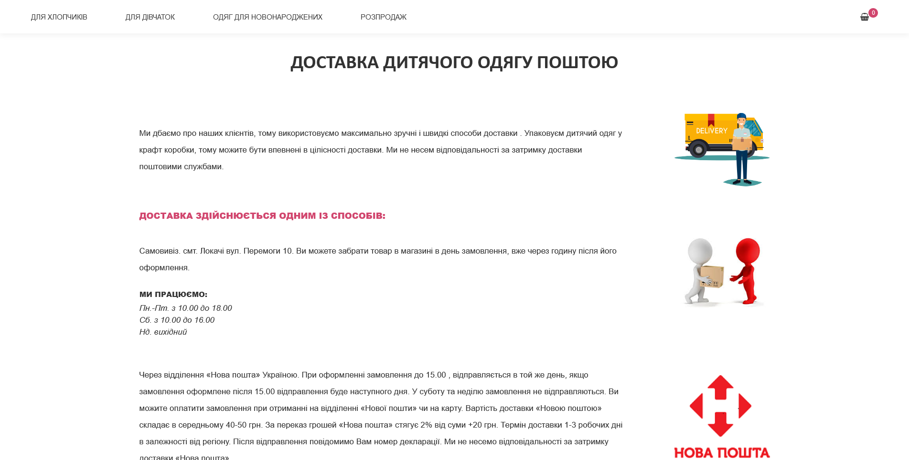
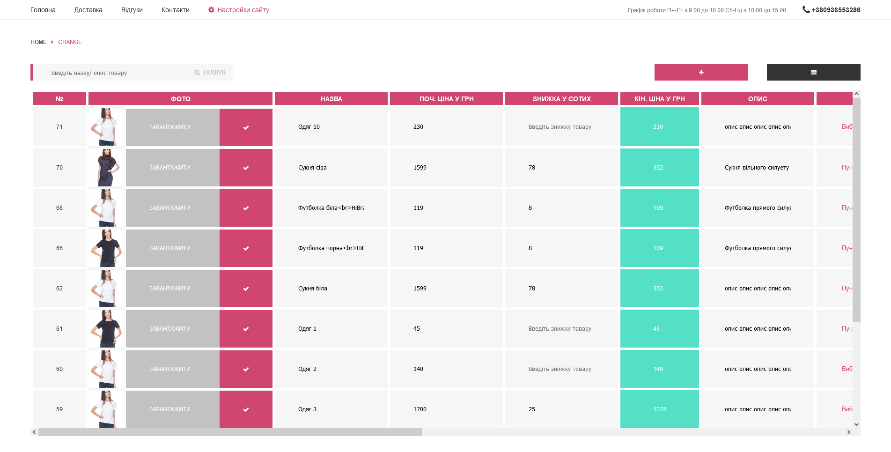

# Bedryk Store + CRM

Bedryk, my first online clothing store built in PHP in 2020, was developed using a tech stack comprising PHP, SQL, RedBeanPHP, LESS/CSS3, and JavaScript, all hosted and tested through the Open Server environment. I have attempted to create my own CRM (Customer Relationship Management) system. As it was my first major project, I made some folder structure mistakes.
  

